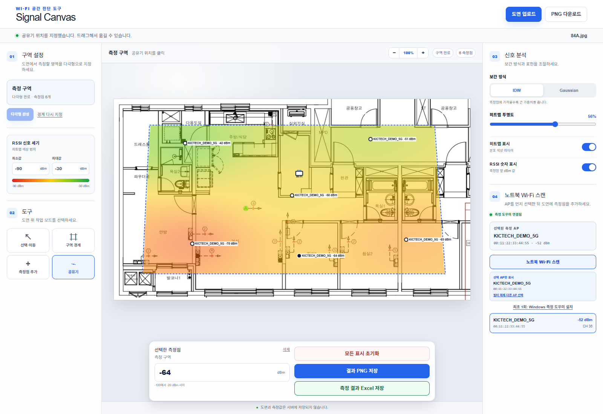

# Signal Canvas

**아파트·사무실 도면 위에서 Wi-Fi RSSI를 측정하고 음영지역을 히트맵으로 시각화하는 웹앱입니다.**

[🌐 공개 웹앱 실행](https://signal-canvas-wifi.kictechass.chatgpt.site) · [📘 사용자 매뉴얼](USER_MANUAL_KO.md) · [📄 Word 매뉴얼](docs/Signal_Canvas_User_Manual_KO.docx) · [🐞 오류·기능 제안](https://github.com/kictech/signal-canvas-wifi/issues)



## 무엇을 할 수 있나요?

- JPG, PNG, PDF 도면 업로드
- 3개 이상의 점으로 자유로운 다각형 측정 구역 설정
- 도면 확대·축소 및 측정점 드래그 이동
- Windows Native Wi-Fi API를 이용한 실제 SSID·BSSID·RSSI 스캔
- 동일한 SSID의 AP를 BSSID로 구분하여 측정
- 선택한 AP만 표시하는 AP 고정 필터
- 측정점별 RSSI 직접 입력·수정·삭제
- IDW 또는 Gaussian 방식의 Wi-Fi 히트맵
- RSSI 최소·최대 색상 범위와 투명도 조절
- 공유기 위치 표시
- 히트맵 PNG 및 측정 결과 Excel 저장

## 빠른 시작

1. [공개 웹앱](https://signal-canvas-wifi.kictechass.chatgpt.site)을 엽니다.
2. JPG, PNG 또는 PDF 도면을 업로드합니다.
3. **구역 경계**를 선택하고 도면 위에 다각형 측정 구역을 만듭니다.
4. RSSI를 직접 입력하거나, Windows 측정 도우미로 주변 AP를 스캔합니다.
5. 측정할 AP를 선택한 뒤 **측정점 추가**로 도면의 실제 위치를 클릭합니다.
6. 위치를 옮길 때마다 `Wi-Fi 스캔 → AP 확인 → 도면 클릭`을 반복합니다.
7. 히트맵을 확인하고 PNG 또는 Excel로 저장합니다.

> 측정점에는 **가장 최근 스캔에서 선택한 AP의 RSSI**가 저장됩니다. 위치를 이동한 뒤에는 반드시 다시 스캔해 주세요.


## Windows 측정 도우미

브라우저는 보안 정책상 주변 Wi-Fi 정보를 직접 읽을 수 없습니다. Windows 10/11 노트북에서 자동 측정하려면 웹앱 오른쪽의 **최초 1회: Windows 측정 도우미 설치**를 사용합니다.

1. 웹앱에서 측정 도우미 ZIP을 내려받아 완전히 압축 해제합니다.
2. `install-helper.bat`을 한 번 실행합니다.
3. Windows 위치 서비스와 **데스크톱 앱에서 위치에 액세스**를 허용합니다.
4. 웹앱의 **노트북 Wi-Fi 스캔**을 누르고 `signalcanvas` 실행 요청을 허용합니다.

`run-helper.bat`은 자동 실행이 되지 않을 때 사용하는 수동 실행용입니다. `launch-helper.vbs`는 웹앱 연동에 사용되므로 직접 실행할 필요가 없습니다.

도우미는 Windows Native Wi-Fi API의 `WLAN_BSS_ENTRY.lRssi` 값을 사용하고, `127.0.0.1:8765`에서만 동작합니다. 자세한 설치 및 문제 해결은 [사용자 매뉴얼](USER_MANUAL_KO.md)을 참고하세요.

## 화면 구성


| 영역 | 주요 기능 |
| --- | --- |
| 왼쪽 | 다각형 구역, RSSI 최소·최대 색상 범위, 측정 도구 |
| 중앙 | 도면, 확대·축소, 측정점 편집, PNG·Excel 저장 |
| 오른쪽 | 보간 방식, 투명도, 표시 옵션, Wi-Fi 스캔 및 AP 선택 |

## 결과 해석

- RSSI는 보통 음수 dBm으로 표시되며 `0`에 가까울수록 신호가 강합니다.
- IDW는 가까운 측정점의 영향을 크게 반영하고, Gaussian은 신호 분포를 더 부드럽게 표현합니다.
- 히트맵은 측정값 사이의 공간을 추정한 시각적 보간 결과이며 전문 전파 설계·인증 결과를 대체하지 않습니다.
- 비교 측정에서는 RSSI 최소·최대값과 보간 방식을 동일하게 유지하는 것이 좋습니다.

## 데이터 및 보안

- 도면과 측정점은 서버에 업로드하거나 저장하지 않고 현재 브라우저 탭에서 처리합니다.
- 선택한 AP의 SSID와 BSSID 필터만 브라우저 로컬 저장소에 보관됩니다.
- Windows 도우미는 로컬 루프백 주소에서만 대기합니다.
- 새로 고침이나 탭 종료 시 작업 내용이 사라질 수 있으므로 PNG와 Excel 결과를 먼저 저장하세요.
- 공개 장소의 무선 정보와 시설 도면을 공유할 때는 관련 보안 정책을 확인하세요.

## 지원 환경

| 항목 | 권장 환경 |
| --- | --- |
| 브라우저 | 최신 Microsoft Edge 또는 Google Chrome |
| 도면 | JPG, JPEG, PNG, PDF |
| 자동 Wi-Fi 측정 | Windows 10/11, 활성화된 Wi-Fi 어댑터, Python 3 |
| 직접 RSSI 입력 | 데스크톱·모바일 최신 브라우저 |

## 로컬 개발

Node.js `22.13.0` 이상이 필요합니다.

```bash
npm install
npm run dev
npm run build
npm test
```

주요 웹앱 코드는 `app/`에 있으며, Sites 배포 설정은 `.openai/hosting.json`에 있습니다.

## 문서와 지원

- [한국어 사용자 매뉴얼](USER_MANUAL_KO.md)
- [Word 사용자 매뉴얼](docs/Signal_Canvas_User_Manual_KO.docx)
- [GitHub Issues](https://github.com/kictech/signal-canvas-wifi/issues)

문제가 발생하면 운영체제, 브라우저, 재현 절차, 오류 화면을 함께 등록해 주세요. AP 정보가 포함된 화면을 공유할 때는 SSID와 BSSID 노출 여부를 먼저 확인하세요.

---

Signal Canvas는 현재 공개 베타입니다. 실제 현장 피드백과 개선 제안을 환영합니다.
