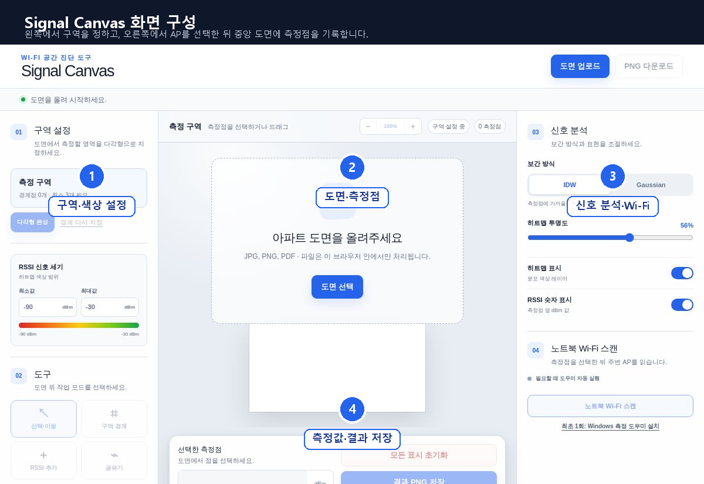
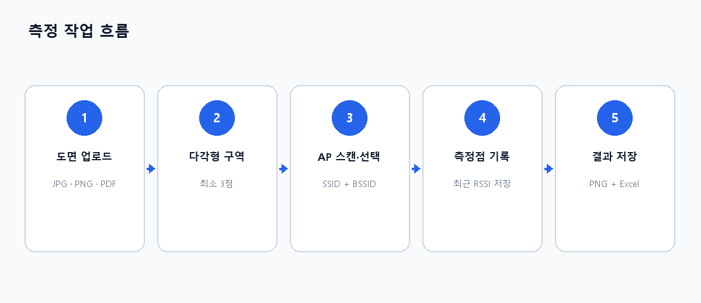

# Signal Canvas 사용자 매뉴얼

버전 1.0 · 2026-07-29

Signal Canvas는 아파트·사무실 도면 위에 Wi-Fi RSSI 측정점을 기록하고, IDW 또는 Gaussian 방식의 히트맵을 생성하는 웹앱입니다. JPG, PNG, PDF 도면을 사용할 수 있으며, Windows 노트북에서는 로컬 측정 도우미를 통해 주변 AP의 SSID, BSSID, RSSI를 직접 스캔할 수 있습니다.

Word 형식은 [Signal_Canvas_User_Manual_KO.docx](docs/Signal_Canvas_User_Manual_KO.docx)에서 받을 수 있습니다.

## 1. 주요 기능

- JPG, PNG, PDF 도면 업로드
- 3개 이상의 점을 사용하는 자유 다각형 측정 구역 설정
- 도면 확대·축소(50~300%)
- Windows Native Wi-Fi API 기반 SSID·BSSID·RSSI 스캔
- 동일 SSID를 BSSID(MAC 주소)로 구분
- 선택한 AP만 다음 스캔부터 표시하는 AP 고정 필터
- 측정점별 AP 정보와 RSSI 저장 및 직접 수정
- 공유기 위치 표시
- IDW 또는 Gaussian 히트맵
- RSSI 색상 범위, 투명도, 히트맵·숫자 표시 조절
- 히트맵 PNG 및 측정 결과 Excel 다운로드

## 2. 준비 사항

| 항목 | 요구 사항 |
| --- | --- |
| 운영체제 | Wi-Fi 자동 측정은 Windows 10/11 권장 |
| 브라우저 | 최신 Microsoft Edge 또는 Google Chrome 권장 |
| 도면 | JPG, JPEG, PNG 또는 PDF |
| 노트북 | 활성화된 Wi-Fi 어댑터 |
| 측정 도우미 | Python 3 필요, 최초 1회 설치 |
| Windows 설정 | 위치 서비스 및 ‘데스크톱 앱에서 위치에 액세스’ 허용 |

> 브라우저는 보안 정책상 주변 Wi-Fi를 직접 스캔할 수 없습니다. 자동 측정에는 로컬 Windows 측정 도우미가 필요합니다. RSSI를 직접 입력하는 작업은 도우미 없이도 가능합니다.

## 3. 화면 구성

| 영역 | 기능 |
| --- | --- |
| 상단 | 도면 업로드, PNG 다운로드, 작업 상태 확인 |
| 왼쪽 | 다각형 구역 설정, RSSI 최소·최대 색상 범위, 작업 도구 선택 |
| 중앙 | 도면, 확대·축소, 측정점 편집, 초기화, PNG·Excel 저장 |
| 오른쪽 | 보간 방식, 투명도, 표시 옵션, 노트북 Wi-Fi 스캔 및 AP 선택 |

**그림 1. Signal Canvas UI 화면 구성** — ① 구역·색상 설정, ② 도면·측정점, ③ 신호 분석·Wi-Fi, ④ 측정값·결과 저장 영역으로 구성됩니다.

작업 도구는 다음 네 가지입니다.

- **선택·이동**: 측정점을 선택하거나 드래그하여 이동
- **구역 경계**: 도면을 차례대로 클릭하여 다각형 경계 작성
- **측정점 추가**: 선택된 AP와 최근 RSSI를 클릭 위치에 저장
- **공유기**: 공유기 위치를 클릭하여 표시하고 드래그하여 이동

**그림 2. 기본 측정 흐름** — 도면 업로드부터 결과 저장까지 왼쪽에서 오른쪽 순서로 진행합니다.

## 4. Windows 측정 도우미 최초 설치

1. 오른쪽의 **최초 1회: Windows 측정 도우미 설치**를 누릅니다.
2. 내려받은 `signal-canvas-wifi-helper.zip`의 압축을 완전히 풉니다.
3. 압축을 푼 폴더에서 `install-helper.bat`을 실행합니다.
4. Windows 또는 브라우저에서 실행 승인을 요청하면 허용합니다.
5. 웹앱으로 돌아와 **노트북 Wi-Fi 스캔**을 누릅니다.
6. `signalcanvas` 링크를 열 것인지 묻는 창이 나오면 허용합니다. 브라우저가 제공하는 경우 ‘항상 허용’을 선택하면 이후 실행이 간편합니다.
7. 오른쪽 상태가 **측정 도우미 연결됨**으로 바뀌는지 확인합니다.

설치 프로그램은 현재 사용자 계정의 `%LOCALAPPDATA%\SignalCanvasWifiHelper`에 파일을 복사하고 `signalcanvas://start` 프로토콜을 등록합니다. 관리자 권한은 필요하지 않습니다. 도우미는 `127.0.0.1:8765`에서만 대기하며 외부 네트워크에는 공개되지 않습니다.

## 5. Windows 위치 권한 설정

1. Windows **설정**을 엽니다.
2. **개인 정보 및 보안 > 위치**로 이동합니다.
3. **위치 서비스**를 켭니다.
4. **데스크톱 앱에서 사용자의 위치에 액세스하도록 허용**을 켭니다.
5. Wi-Fi가 켜져 있는지 확인한 뒤 웹앱에서 다시 스캔합니다.

Windows Native Wi-Fi API는 주변 BSS 정보를 위치 관련 데이터로 보호할 수 있습니다. 권한이 꺼져 있으면 SSID·BSSID·RSSI 조회가 거부될 수 있습니다.

## 6. 기본 측정 절차

### 6.1 도면 업로드

1. 상단 **도면 업로드**를 누릅니다.
2. JPG, JPEG, PNG 또는 PDF 파일을 선택합니다.
3. PDF가 여러 페이지이면 왼쪽의 **이전/다음** 버튼으로 사용할 페이지를 선택합니다.
4. 중앙의 `−`, `100%`, `+` 버튼으로 50~300% 범위에서 도면을 조절합니다. `100%`를 누르면 원래 배율로 돌아갑니다.

도면과 측정값은 서버에 저장되지 않고 현재 브라우저 탭에서만 처리됩니다. 페이지를 새로 고치거나 닫기 전에 PNG와 Excel 결과를 저장하세요.

### 6.2 다각형 측정 구역 설정

1. 왼쪽에서 **구역 경계**를 선택합니다.
2. 측정하려는 구역의 외곽을 순서대로 클릭합니다.
3. 경계점은 최소 3개가 필요하며, 5개보다 많은 점도 사용할 수 있습니다.
4. 필요한 점을 모두 찍은 뒤 **다각형 완성**을 누릅니다.

완성된 구역을 바꾸려면 **경계 다시 지정**을 누릅니다. 측정 구역이 완성된 상태에서는 구역 밖에 측정점을 추가할 수 없습니다.

### 6.3 RSSI 색상 범위 설정

왼쪽 **RSSI 신호 세기**에서 최소값과 최대값을 입력합니다.

- 기본값: 최소 `-90 dBm`, 최대 `-30 dBm`
- 허용 범위: `-120~0 dBm`
- 최소값은 반드시 최대값보다 작아야 합니다.
- 기본 색상은 빨강(약함) → 주황 → 노랑 → 연두 → 초록(강함) 순서입니다.

측정 환경에서 값이 대부분 한 색으로 보이면 실제 RSSI 분포에 맞춰 최소·최대값을 좁혀 대비를 높입니다.

### 6.4 AP 스캔 및 선택

1. 노트북을 실제 측정 위치로 이동합니다.
2. 오른쪽 **노트북 Wi-Fi 스캔**을 누릅니다.
3. 목록에서 측정할 AP를 선택합니다.
4. SSID, BSSID, RSSI, 채널을 확인합니다.

같은 SSID가 여러 줄로 나타나는 것은 정상입니다. 각 무선 AP 또는 라디오는 고유한 **BSSID**로 구분됩니다. 측정 대상은 SSID뿐 아니라 BSSID까지 확인하여 선택하세요.

AP를 선택하면 해당 BSSID가 **선택 AP만 표시** 필터로 저장됩니다. 이후 스캔에서는 선택한 AP만 표시되고, 검색된 최신 RSSI가 자동으로 선택됩니다. 다른 AP를 측정하려면 **필터 해제·다른 AP 선택**을 누른 뒤 다시 스캔합니다.

### 6.5 측정점 추가

1. 실제 측정 위치에서 Wi-Fi를 다시 스캔합니다.
2. 대상 AP와 최신 RSSI가 선택되었는지 확인합니다.
3. 왼쪽에서 **측정점 추가**를 선택합니다.
4. 도면의 실제 위치를 클릭합니다.
5. 저장 메시지에서 SSID, BSSID, RSSI를 확인합니다.

> 측정점에는 클릭 순간 새 스캔을 수행하는 것이 아니라, **가장 최근 스캔에서 선택된 AP의 RSSI**가 저장됩니다. 위치를 옮길 때마다 반드시 다시 스캔한 다음 도면을 클릭하세요.

여러 지점을 측정할 때는 `위치 이동 → 스캔 → AP 확인 → 도면 클릭`을 반복합니다.

### 6.6 측정점 수정·이동·삭제

- **선택·이동** 도구에서 점을 클릭하면 중앙 하단에 값이 표시됩니다.
- 점을 드래그하면 위치를 수정할 수 있습니다.
- RSSI는 `-100~-20 dBm` 범위에서 직접 입력할 수 있습니다.
- 입력 후 `Enter`를 누르거나 입력란 밖을 클릭하면 저장됩니다.
- 선택한 점만 지우려면 측정점 카드의 **삭제**를 누릅니다.
- 모든 경계·측정점·공유기 표시를 지우려면 **모든 표시 초기화**를 누릅니다.

### 6.7 공유기 위치 표시

1. **공유기** 도구를 선택합니다.
2. 도면에서 공유기 설치 위치를 클릭합니다.
3. 위치가 잘못되면 표시를 드래그하여 이동합니다.

공유기 표시는 참고용이며 RSSI 보간 계산에는 사용되지 않습니다.

## 7. 히트맵 조절

### 보간 방식

- **IDW**: 가까운 측정점에 더 큰 가중치를 부여합니다. 측정점 주변의 차이가 비교적 뚜렷합니다.
- **Gaussian**: 일정 영향 반경으로 부드럽게 연결합니다. 전반적인 신호 흐름을 보기 좋습니다.

두 방식 모두 측정값을 바탕으로 빈 공간을 추정합니다. 결과는 실제 전파 측정 자체가 아니라 시각적 보간 결과입니다.

### 표시 옵션

- **히트맵 투명도**: 0~90% 범위에서 도면과 색상 레이어의 균형 조절
- **히트맵 표시**: 색상 레이어 켜기/끄기
- **RSSI 숫자 표시**: 측정점 옆 dBm 값 켜기/끄기

정확한 비교를 위해 같은 도면을 비교할 때는 보간 방식과 RSSI 최소·최대값을 동일하게 유지하는 것이 좋습니다.

## 8. 결과 저장

### PNG 저장

상단 **PNG 다운로드** 또는 중앙 하단 **결과 PNG 저장**을 누릅니다. 도면, 측정점, 공유기, 히트맵, 색상 범례가 하나의 PNG 파일로 저장됩니다.

파일명 형식은 `<도면명>-wifi-heatmap.png`입니다.

### Excel 저장

중앙 하단 **측정 결과 Excel 저장**을 누릅니다.

- 세로축: 측정 위치 `P1`, `P2`, `P3` …
- 가로축: AP의 `SSID (BSSID)`
- 셀 값: 해당 위치·AP의 RSSI(dBm)
- 측정되지 않은 조합: 빈 셀

파일명 형식은 `<도면명>-rssi-results.xlsx`입니다. BSSID가 저장된 측정점이 하나 이상 있어야 Excel 파일을 만들 수 있습니다.

## 9. 권장 측정 방법

1. 노트북의 방향과 높이를 가능한 한 일정하게 유지합니다.
2. 각 위치에서 이동 직후 2~3초 기다린 다음 스캔합니다.
3. 같은 지점에서 값이 크게 변하면 여러 번 스캔하고 대표값을 사용합니다.
4. 같은 SSID라도 BSSID가 다른 AP를 혼동하지 않습니다.
5. 문, 가구, 사람의 위치 등 측정 조건을 기록합니다.
6. 비교 측정에서는 동일한 RSSI 색상 범위와 보간 방식을 사용합니다.

## 10. 문제 해결

| 증상 | 확인 및 해결 방법 |
| --- | --- |
| 도우미가 실행되지 않음 | ZIP 압축을 풀고 `install-helper.bat`을 다시 실행한 뒤 브라우저의 `signalcanvas` 실행 요청을 허용합니다. |
| 측정 도우미에 연결할 수 없음 | Python 3 설치 여부를 확인합니다. `%LOCALAPPDATA%\SignalCanvasWifiHelper`의 `run-helper.bat`을 직접 실행한 뒤 다시 스캔합니다. |
| 위치 권한 거부 오류 | Windows 위치 서비스와 ‘데스크톱 앱에서 위치에 액세스’를 모두 켭니다. |
| Wi-Fi 목록이 비어 있음 | 노트북 Wi-Fi와 무선 어댑터를 확인하고 AP 가까이에서 다시 스캔합니다. |
| 선택한 AP가 검색되지 않음 | AP가 켜져 있는지 확인하고 가까이 이동합니다. 다른 AP를 선택하려면 필터를 해제합니다. |
| 동일 SSID가 여러 개 표시됨 | BSSID가 다르면 서로 다른 AP 또는 라디오입니다. 목표 BSSID를 확인합니다. |
| 측정점이 추가되지 않음 | 다각형 안을 클릭했는지, AP가 선택되었는지, **측정점 추가** 도구가 활성화되었는지 확인합니다. |
| RSSI 직접 입력이 저장되지 않음 | `-100~-20` 사이 숫자를 입력하고 `Enter`를 누르거나 입력란 밖을 클릭합니다. |
| 히트맵이 한 색으로 보임 | 측정점 수를 늘리거나 RSSI 최소·최대 색상 범위를 실제 값에 맞게 조절합니다. |
| PDF가 열리지 않음 | 인터넷 연결을 확인하고 브라우저를 새로 고친 뒤 다시 업로드합니다. PDF 렌더링 모듈은 외부 CDN에서 로드됩니다. |
| 결과 파일이 내려받아지지 않음 | 브라우저의 다운로드 또는 여러 파일 다운로드 차단 여부를 확인합니다. |

## 11. 데이터 및 보안

- 도면과 측정점은 서버에 업로드하거나 저장하지 않습니다.
- AP 고정 정보(SSID와 BSSID)는 브라우저의 로컬 저장소에 보관됩니다.
- 측정 도우미는 `127.0.0.1`에서만 동작하며, 스캔 결과는 요청한 브라우저 탭으로만 반환합니다.
- 새로 고침 또는 탭 종료 시 도면과 측정점 작업 내용이 사라질 수 있습니다.
- 공개 장소의 무선 정보와 도면을 공유할 때는 개인정보 및 시설 보안 정책을 확인하세요.

## 12. 용어

| 용어 | 의미 |
| --- | --- |
| SSID | 사용자에게 보이는 Wi-Fi 네트워크 이름 |
| BSSID | AP 또는 무선 라디오를 구분하는 MAC 주소 |
| RSSI | 수신 신호 강도. 일반적으로 0에 가까운 음수일수록 강함 |
| IDW | 거리가 가까운 측정값에 더 큰 가중치를 주는 보간 방식 |
| Gaussian | 가우시안 영향 반경으로 값을 부드럽게 연결하는 보간 방식 |
